# Algorithm Step-by-Step Comparison

This diagram shows how each algorithm processes the same input array `[4, 2, 7, 2, 9]`.

```mermaid
graph TB
    subgraph Example["Example Array: [4, 2, 7, 2, 9]"]
    end
    
    subgraph BruteForce["1. BRUTE FORCE APPROACH O(n²)"]
        BF1["Step 1: i=0, j=1<br/>Compare: 4 vs 2<br/>Result: Not Equal ❌"]
        BF2["Step 2: i=0, j=2<br/>Compare: 4 vs 7<br/>Result: Not Equal ❌"]
        BF3["Step 3: i=0, j=3<br/>Compare: 4 vs 2<br/>Result: Not Equal ❌"]
        BF4["Step 4: i=0, j=4<br/>Compare: 4 vs 9<br/>Result: Not Equal ❌"]
        BF5["Step 5: i=1, j=2<br/>Compare: 2 vs 7<br/>Result: Not Equal ❌"]
        BF6["Step 6: i=1, j=3<br/>Compare: 2 vs 2<br/>Result: EQUAL ✓<br/>Return TRUE"]
        
        BF1 --> BF2 --> BF3 --> BF4 --> BF5 --> BF6
        
        BFResult["Total Comparisons: 6<br/>Duplicate Found at indices 1 and 3"]
        BF6 --> BFResult
    end
    
    subgraph Sorted["2. SORTED TECHNIQUE O(n log n)"]
        S1["Step 1: Create Copy<br/>Array: [4, 2, 7, 2, 9]"]
        S2["Step 2: Sort Array<br/>Sorted: [2, 2, 4, 7, 9]"]
        S3["Step 3: i=0<br/>Compare: 2 vs 2<br/>Result: EQUAL ✓<br/>Return TRUE"]
        
        S1 --> S2 --> S3
        
        SResult["Total Comparisons: 1<br/>Duplicates are adjacent after sorting"]
        S3 --> SResult
    end
    
    subgraph HashSet["3. HASH SET APPROACH O(n) ⭐ FASTEST"]
        H1["Step 1: seen = {}<br/>Check: 4 in Set? NO<br/>Add: seen = {4}"]
        H2["Step 2: seen = {4}<br/>Check: 2 in Set? NO<br/>Add: seen = {4, 2}"]
        H3["Step 3: seen = {4, 2}<br/>Check: 7 in Set? NO<br/>Add: seen = {4, 2, 7}"]
        H4["Step 4: seen = {4, 2, 7}<br/>Check: 2 in Set? YES ✓<br/>Return TRUE"]
        
        H1 --> H2 --> H3 --> H4
        
        HResult["Total Checks: 4<br/>Instant lookup with Set"]
        H4 --> HResult
    end
    
    Example --> BruteForce
    Example --> Sorted
    Example --> HashSet
    
    %% Styling
    style Example fill:#6366f1,stroke:#4f46e5,stroke-width:3px,color:#fff,font-weight:bold
    
    style BF6 fill:#86efac,stroke:#22c55e,stroke-width:3px,color:#000,font-weight:bold
    style BFResult fill:#fca5a5,stroke:#ef4444,stroke-width:2px,color:#000
    
    style S3 fill:#86efac,stroke:#22c55e,stroke-width:3px,color:#000,font-weight:bold
    style SResult fill:#fca5a5,stroke:#ef4444,stroke-width:2px,color:#000
    
    style H4 fill:#86efac,stroke:#22c55e,stroke-width:3px,color:#000,font-weight:bold
    style HResult fill:#fca5a5,stroke:#ef4444,stroke-width:2px,color:#000
```

## Key Takeaways

- **Brute Force**: 6 comparisons needed
- **Sorted**: Only 1 comparison (after sorting)
- **Hash Set**: 4 checks with instant lookup

**Winner:** Hash Set approach for best time complexity O(n)!