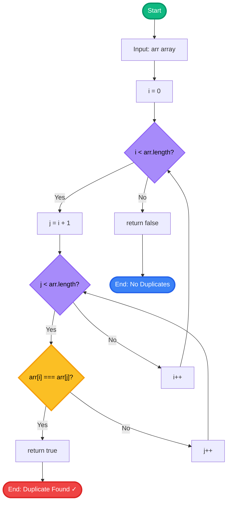

```mermaid
flowchart TD
    Start([Start]) --> Input[Input: arr array]
    Input --> InitI[i = 0]
    
    InitI --> CheckI{i < arr.length?}
    
    CheckI -->|Yes| InitJ[j = i + 1]
    CheckI -->|No| ReturnFalse[return false]
    
    InitJ --> CheckJ{j < arr.length?}
    
    CheckJ -->|Yes| Compare{"arr[i] === arr[j]?"}
    CheckJ -->|No| IncI[i++]
    
    Compare -->|Yes| ReturnTrue[return true]
    Compare -->|No| IncJ[j++]
    
    IncJ --> CheckJ
    IncI --> CheckI
    
    ReturnTrue --> EndTrue([End: Duplicate Found ✓])
    ReturnFalse --> EndFalse([End: No Duplicates])
    
    %% Styling
    style Start fill:#10b981,stroke:#059669,stroke-width:3px,color:#fff
    style EndTrue fill:#ef4444,stroke:#dc2626,stroke-width:3px,color:#fff
    style EndFalse fill:#3b82f6,stroke:#2563eb,stroke-width:3px,color:#fff
    style CheckI fill:#a78bfa,stroke:#8b5cf6,stroke-width:2px,color:#000
    style CheckJ fill:#a78bfa,stroke:#8b5cf6,stroke-width:2px,color:#000
    style Compare fill:#fbbf24,stroke:#f59e0b,stroke-width:3px,color:#000
```