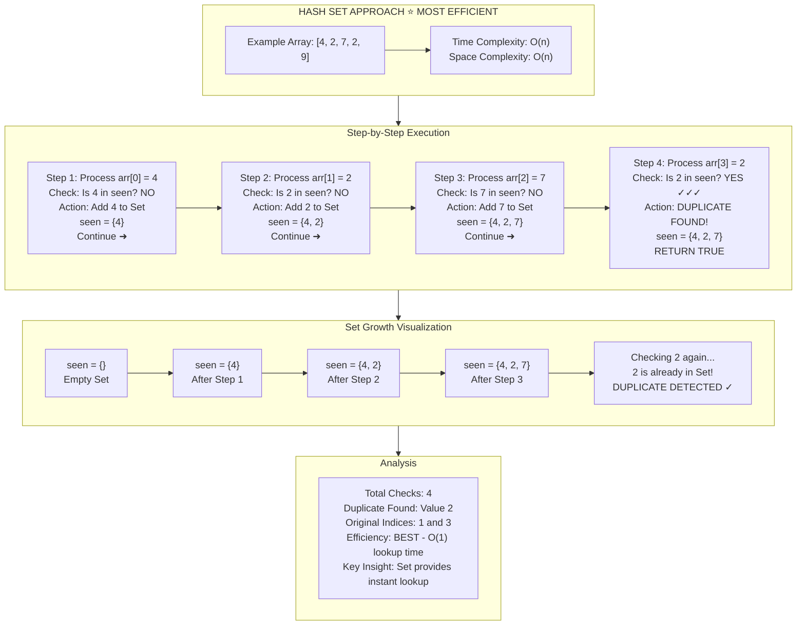

```mermaid
graph TB
    subgraph Header["HASH SET APPROACH ⭐ MOST EFFICIENT"]
        Title["Example Array: [4, 2, 7, 2, 9]"]
        Complexity["Time Complexity: O(n)<br/>Space Complexity: O(n)"]
        Title --> Complexity
    end
    
    subgraph Steps["Step-by-Step Execution"]
        H1["Step 1: Process arr[0] = 4<br/>Check: Is 4 in seen? NO<br/>Action: Add 4 to Set<br/>seen = {4}<br/>Continue ➜"]
        H2["Step 2: Process arr[1] = 2<br/>Check: Is 2 in seen? NO<br/>Action: Add 2 to Set<br/>seen = {4, 2}<br/>Continue ➜"]
        H3["Step 3: Process arr[2] = 7<br/>Check: Is 7 in seen? NO<br/>Action: Add 7 to Set<br/>seen = {4, 2, 7}<br/>Continue ➜"]
        H4["Step 4: Process arr[3] = 2<br/>Check: Is 2 in seen? YES ✓✓✓<br/>Action: DUPLICATE FOUND!<br/>seen = {4, 2, 7}<br/>RETURN TRUE"]
        
        H1 --> H2 --> H3 --> H4
    end
    
    subgraph SetVisualization["Set Growth Visualization"]
        V1["seen = {}<br/>Empty Set"]
        V2["seen = {4}<br/>After Step 1"]
        V3["seen = {4, 2}<br/>After Step 2"]
        V4["seen = {4, 2, 7}<br/>After Step 3"]
        V5["Checking 2 again...<br/>2 is already in Set!<br/>DUPLICATE DETECTED ✓"]
        
        V1 --> V2 --> V3 --> V4 --> V5
    end
    
    subgraph Result["Analysis"]
        Summary["Total Checks: 4<br/>Duplicate Found: Value 2<br/>Original Indices: 1 and 3<br/>Efficiency: BEST - O(1) lookup time<br/>Key Insight: Set provides instant lookup"]
    end
    
    Header --> Steps
    Steps --> SetVisualization
    SetVisualization --> Result
```