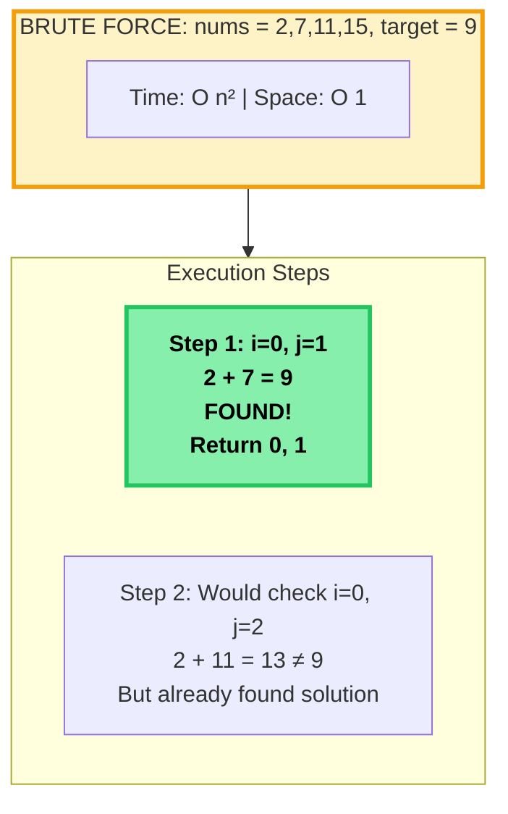
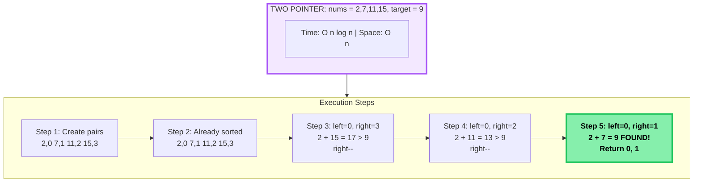
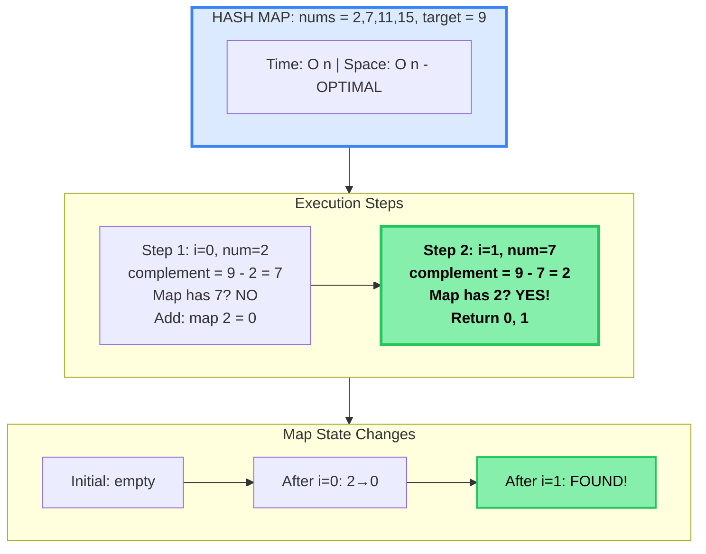
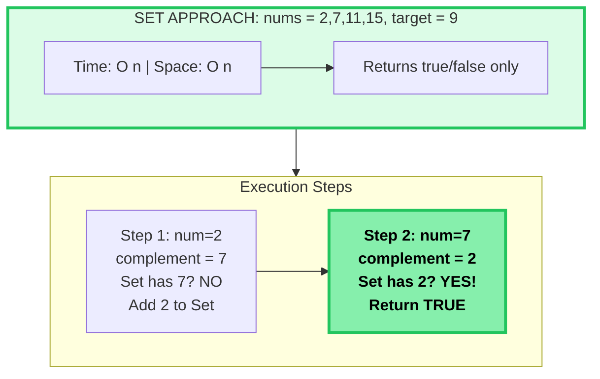
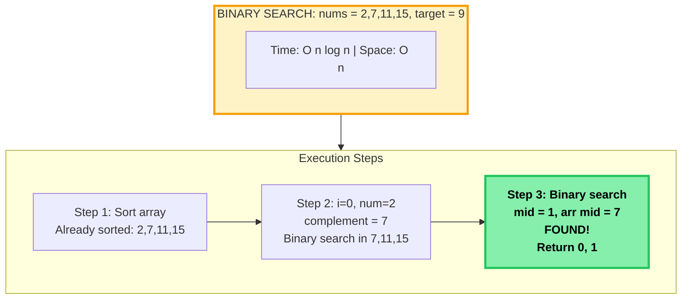
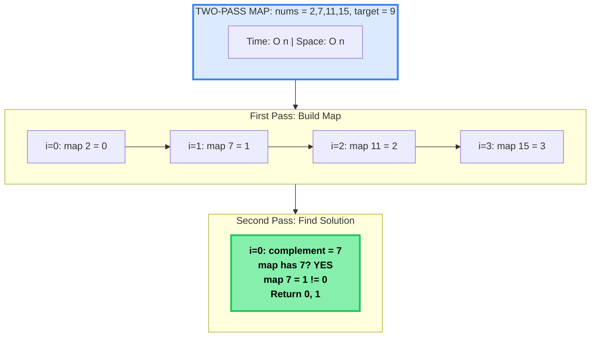
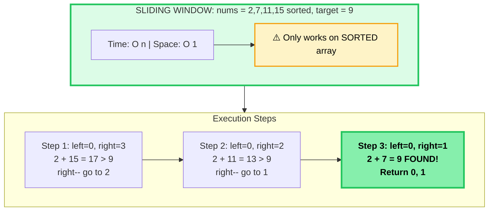

# Brute Froce Example Flow 

```mermaid
graph TB
    subgraph Header["BRUTE FORCE: nums = 2,7,11,15, target = 9"]
        Title["Time: O n² | Space: O 1"]
    end
    
    subgraph Steps["Execution Steps"]
        S1["Step 1: i=0, j=1<br/>2 + 7 = 9<br/>FOUND!<br/>Return 0, 1"]
        S2["Step 2: Would check i=0, j=2<br/>2 + 11 = 13 ≠ 9<br/>But already found solution"]
    end
    
    Header --> Steps
    
    style Header fill:#fef3c7,stroke:#f59e0b,stroke-width:3px
    style S1 fill:#86efac,stroke:#22c55e,stroke-width:3px,color:#000,font-weight:bold
```

# Sorting + Two Pointer 

```mermaid
graph TB
    subgraph Header["TWO POINTER: nums = 2,7,11,15, target = 9"]
        Title["Time: O n log n | Space: O n"]
    end
    
    subgraph Steps["Execution Steps"]
        S1["Step 1: Create pairs<br/>2,0  7,1  11,2  15,3"]
        S2["Step 2: Already sorted<br/>2,0  7,1  11,2  15,3"]
        S3["Step 3: left=0, right=3<br/>2 + 15 = 17 > 9<br/>right--"]
        S4["Step 4: left=0, right=2<br/>2 + 11 = 13 > 9<br/>right--"]
        S5["Step 5: left=0, right=1<br/>2 + 7 = 9 FOUND!<br/>Return 0, 1"]
        
        S1 --> S2 --> S3 --> S4 --> S5
    end
    
    Header --> Steps
    
    style Header fill:#f3e8ff,stroke:#a855f7,stroke-width:3px
    style S5 fill:#86efac,stroke:#22c55e,stroke-width:3px,color:#000,font-weight:bold
```

# Hashmap 

```mermaid
graph TB
    subgraph Header["HASH MAP: nums = 2,7,11,15, target = 9"]
        Title["Time: O n | Space: O n - OPTIMAL"]
    end
    
    subgraph Steps["Execution Steps"]
        S1["Step 1: i=0, num=2<br/>complement = 9 - 2 = 7<br/>Map has 7? NO<br/>Add: map 2 = 0"]
        S2["Step 2: i=1, num=7<br/>complement = 9 - 7 = 2<br/>Map has 2? YES!<br/>Return 0, 1"]
        
        S1 --> S2
    end
    
    subgraph MapState["Map State Changes"]
        M1["Initial: empty"]
        M2["After i=0: 2→0"]
        M3["After i=1: FOUND!"]
        
        M1 --> M2 --> M3
    end
    
    Header --> Steps
    Steps --> MapState
    
    style Header fill:#dbeafe,stroke:#3b82f6,stroke-width:3px
    style S2 fill:#86efac,stroke:#22c55e,stroke-width:3px,color:#000,font-weight:bold
    style M3 fill:#86efac,stroke:#22c55e,stroke-width:2px,color:#000
```

# HashSet

```mermaid
graph TB
    subgraph Header["SET APPROACH: nums = 2,7,11,15, target = 9"]
        Title["Time: O n | Space: O n"]
        Note["Returns true/false only"]
        Title --> Note
    end
    
    subgraph Steps["Execution Steps"]
        S1["Step 1: num=2<br/>complement = 7<br/>Set has 7? NO<br/>Add 2 to Set"]
        S2["Step 2: num=7<br/>complement = 2<br/>Set has 2? YES!<br/>Return TRUE"]
        
        S1 --> S2
    end
    
    Header --> Steps
    
    style Header fill:#dcfce7,stroke:#22c55e,stroke-width:3px
    style S2 fill:#86efac,stroke:#22c55e,stroke-width:3px,color:#000,font-weight:bold
```

# Binary Search 

```mermaid
graph TB
    subgraph Header["BINARY SEARCH: nums = 2,7,11,15, target = 9"]
        Title["Time: O n log n | Space: O n"]
    end
    
    subgraph Steps["Execution Steps"]
        S1["Step 1: Sort array<br/>Already sorted: 2,7,11,15"]
        S2["Step 2: i=0, num=2<br/>complement = 7<br/>Binary search in 7,11,15"]
        S3["Step 3: Binary search<br/>mid = 1, arr mid = 7<br/>FOUND!<br/>Return 0, 1"]
        
        S1 --> S2 --> S3
    end
    
    Header --> Steps
    
    style Header fill:#fef3c7,stroke:#f59e0b,stroke-width:3px
    style S3 fill:#86efac,stroke:#22c55e,stroke-width:3px,color:#000,font-weight:bold
```

# TWO-PASS HASH MAP

```mermaid
graph TB
    subgraph Header["TWO-PASS MAP: nums = 2,7,11,15, target = 9"]
        Title["Time: O n | Space: O n"]
    end
    
    subgraph Pass1["First Pass: Build Map"]
        P1["i=0: map 2 = 0"]
        P2["i=1: map 7 = 1"]
        P3["i=2: map 11 = 2"]
        P4["i=3: map 15 = 3"]
        P1 --> P2 --> P3 --> P4
    end
    
    subgraph Pass2["Second Pass: Find Solution"]
        S1["i=0: complement = 7<br/>map has 7? YES<br/>map 7 = 1 != 0<br/>Return 0, 1"]
    end
    
    Header --> Pass1
    Pass1 --> Pass2
    
    style Header fill:#dbeafe,stroke:#3b82f6,stroke-width:3px
    style S1 fill:#86efac,stroke:#22c55e,stroke-width:3px,color:#000,font-weight:bold
```
# SLIDING WINDOW (Sorted Array Only)

```mermaid
graph TB
    subgraph Header["SLIDING WINDOW: nums = 2,7,11,15 sorted, target = 9"]
        Title["Time: O n | Space: O 1"]
        Warning["⚠️ Only works on SORTED array"]
        Title --> Warning
    end
    
    subgraph Steps["Execution Steps"]
        S1["Step 1: left=0, right=3<br/>2 + 15 = 17 > 9<br/>right-- go to 2"]
        S2["Step 2: left=0, right=2<br/>2 + 11 = 13 > 9<br/>right-- go to 1"]
        S3["Step 3: left=0, right=1<br/>2 + 7 = 9 FOUND!<br/>Return 0, 1"]
        
        S1 --> S2 --> S3
    end
    
    Header --> Steps
    
    style Header fill:#dcfce7,stroke:#22c55e,stroke-width:3px
    style Warning fill:#fef3c7,stroke:#f59e0b,stroke-width:2px,color:#000
    style S3 fill:#86efac,stroke:#22c55e,stroke-width:3px,color:#000,font-weight:bold
```
