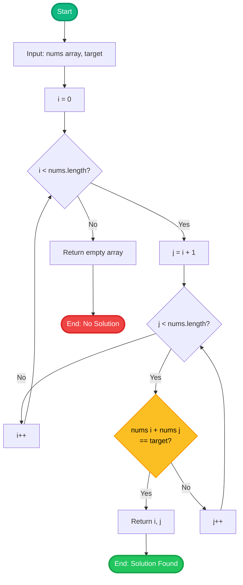
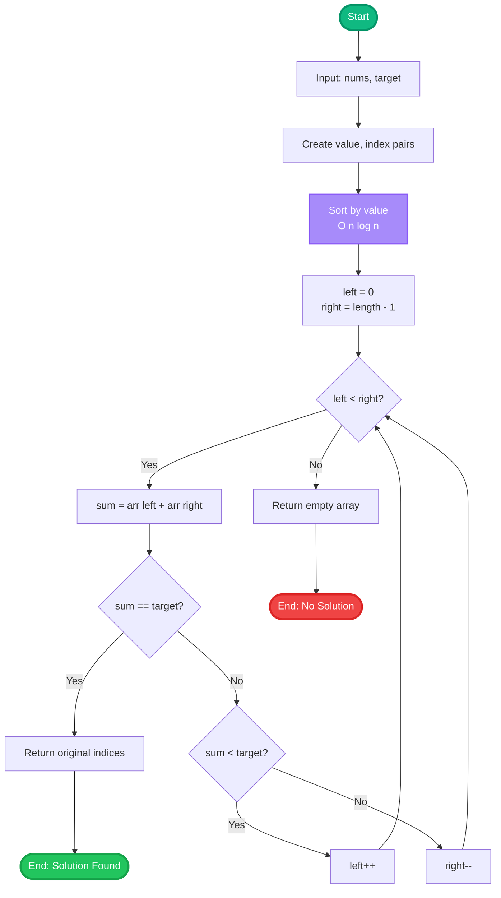
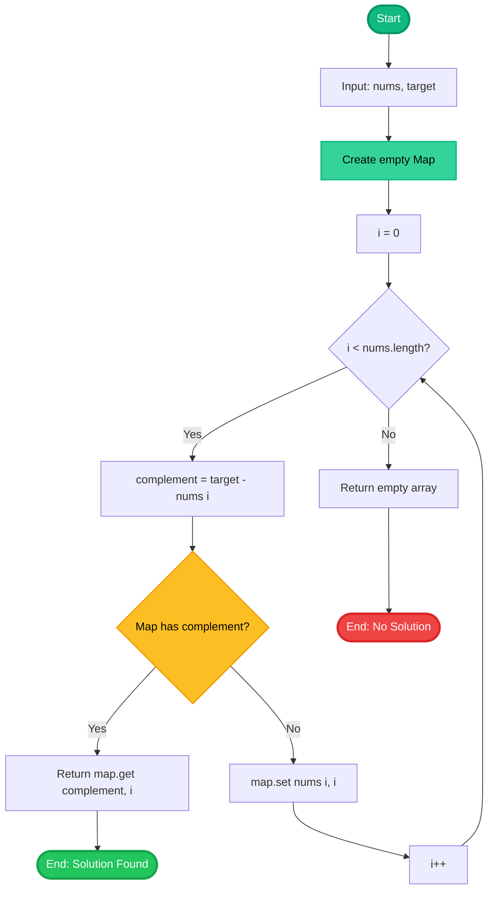
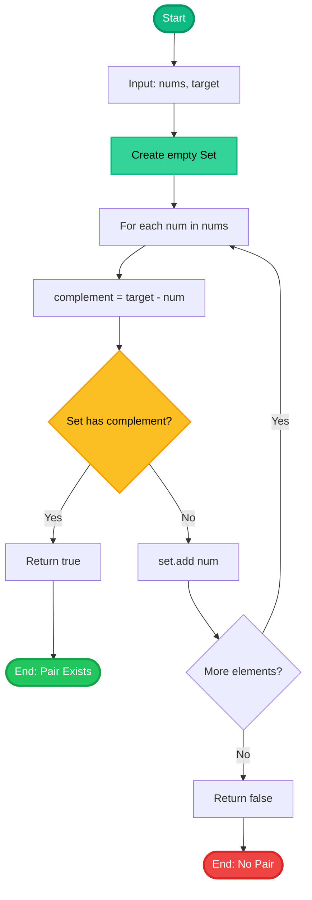
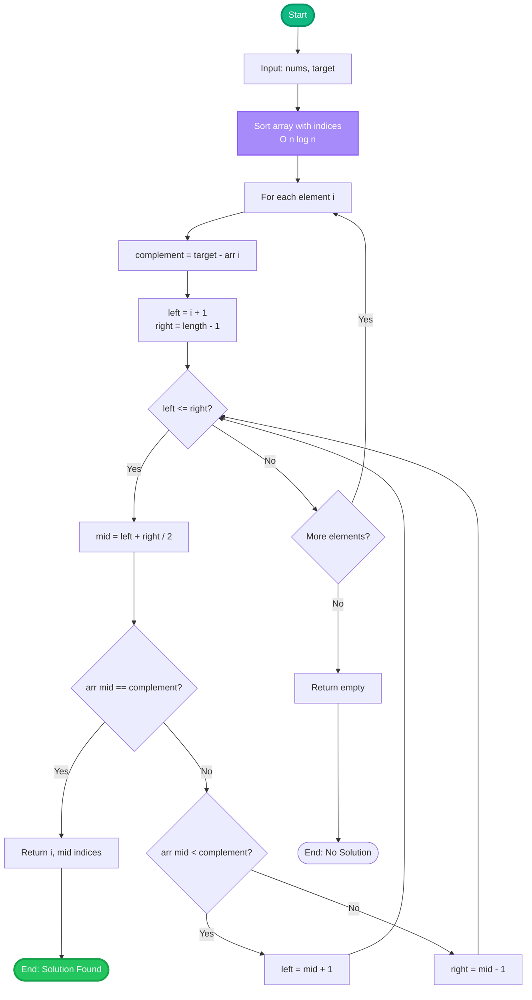
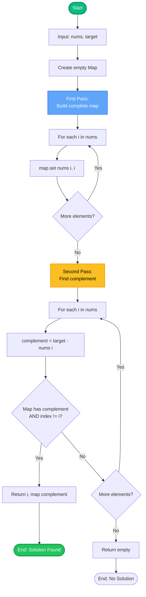

# BruteFroce Approach 

```mermaid
flowchart TD
    Start([Start]) --> Input["Input: nums array, target"]
    Input --> InitI[i = 0]
    
    InitI --> OuterLoop{"i < nums.length?"}
    OuterLoop -->|No| NotFound[Return empty array]
    OuterLoop -->|Yes| InitJ[j = i + 1]
    
    InitJ --> InnerLoop{"j < nums.length?"}
    InnerLoop -->|No| IncI[i++]
    InnerLoop -->|Yes| CheckSum{"nums i + nums j<br/>== target?"}
    
    CheckSum -->|Yes| Found["Return i, j"]
    CheckSum -->|No| IncJ[j++]
    
    IncJ --> InnerLoop
    IncI --> OuterLoop
    
    Found --> End([End: Solution Found])
    NotFound --> End2([End: No Solution])
    
    style Start fill:#10b981,stroke:#059669,stroke-width:3px,color:#fff
    style End fill:#22c55e,stroke:#16a34a,stroke-width:3px,color:#fff
    style End2 fill:#ef4444,stroke:#dc2626,stroke-width:3px,color:#fff
    style CheckSum fill:#fbbf24,stroke:#f59e0b,stroke-width:2px,color:#000
```

# Sorting Two Pointer

```mermaid
flowchart TD
    Start([Start]) --> Input["Input: nums, target"]
    Input --> CreatePairs["Create value, index pairs"]
    
    CreatePairs --> Sort["Sort by value<br/>O n log n"]
    Sort --> Init["left = 0<br/>right = length - 1"]
    
    Init --> Loop{"left < right?"}
    Loop -->|No| NotFound[Return empty array]
    Loop -->|Yes| CalcSum["sum = arr left + arr right"]
    
    CalcSum --> CheckSum{"sum == target?"}
    CheckSum -->|Yes| Found["Return original indices"]
    CheckSum -->|No| CompareSum{"sum < target?"}
    
    CompareSum -->|Yes| IncLeft[left++]
    CompareSum -->|No| DecRight[right--]
    
    IncLeft --> Loop
    DecRight --> Loop
    
    Found --> End([End: Solution Found])
    NotFound --> End2([End: No Solution])
    
    style Start fill:#10b981,stroke:#059669,stroke-width:3px,color:#fff
    style End fill:#22c55e,stroke:#16a34a,stroke-width:3px,color:#fff
    style End2 fill:#ef4444,stroke:#dc2626,stroke-width:3px,color:#fff
    style Sort fill:#a78bfa,stroke:#8b5cf6,stroke-width:2px,color:#fff
```

# Hashmap 

```mermaid
flowchart TD
    Start([Start]) --> Input["Input: nums, target"]
    Input --> CreateMap["Create empty Map"]
    
    CreateMap --> InitLoop[i = 0]
    InitLoop --> Loop{"i < nums.length?"}
    
    Loop -->|No| NotFound[Return empty array]
    Loop -->|Yes| CalcComp["complement = target - nums i"]
    
    CalcComp --> CheckMap{"Map has complement?"}
    CheckMap -->|Yes| Found["Return map.get complement, i"]
    CheckMap -->|No| AddToMap["map.set nums i, i"]
    
    AddToMap --> Inc[i++]
    Inc --> Loop
    
    Found --> End([End: Solution Found])
    NotFound --> End2([End: No Solution])
    
    style Start fill:#10b981,stroke:#059669,stroke-width:3px,color:#fff
    style End fill:#22c55e,stroke:#16a34a,stroke-width:3px,color:#fff
    style End2 fill:#ef4444,stroke:#dc2626,stroke-width:3px,color:#fff
    style CheckMap fill:#fbbf24,stroke:#f59e0b,stroke-width:2px,color:#000
    style CreateMap fill:#34d399,stroke:#10b981,stroke-width:2px,color:#000
```

# HashSet 

```mermaid
flowchart TD
    Start([Start]) --> Input["Input: nums, target"]
    Input --> CreateSet["Create empty Set"]
    
    CreateSet --> Loop["For each num in nums"]
    Loop --> CalcComp["complement = target - num"]
    
    CalcComp --> CheckSet{"Set has complement?"}
    CheckSet -->|Yes| Found[Return true]
    CheckSet -->|No| AddToSet["set.add num"]
    
    AddToSet --> MoreElements{"More elements?"}
    MoreElements -->|Yes| Loop
    MoreElements -->|No| NotFound[Return false]
    
    Found --> End([End: Pair Exists])
    NotFound --> End2([End: No Pair])
    
    style Start fill:#10b981,stroke:#059669,stroke-width:3px,color:#fff
    style End fill:#22c55e,stroke:#16a34a,stroke-width:3px,color:#fff
    style End2 fill:#ef4444,stroke:#dc2626,stroke-width:3px,color:#fff
    style CheckSet fill:#fbbf24,stroke:#f59e0b,stroke-width:2px,color:#000
    style CreateSet fill:#34d399,stroke:#10b981,stroke-width:2px,color:#000

```

# Binary Search

```mermaid
flowchart TD
    Start([Start]) --> Input["Input: nums, target"]
    Input --> Sort["Sort array with indices<br/>O n log n"]
    
    Sort --> OuterLoop["For each element i"]
    OuterLoop --> CalcComp["complement = target - arr i"]
    
    CalcComp --> InitBinary["left = i + 1<br/>right = length - 1"]
    InitBinary --> BinaryLoop{"left <= right?"}
    
    BinaryLoop -->|No| NextElement{More elements?}
    BinaryLoop -->|Yes| CalcMid["mid = left + right / 2"]
    
    CalcMid --> CheckMid{"arr mid == complement?"}
    CheckMid -->|Yes| Found["Return i, mid indices"]
    CheckMid -->|No| Compare{"arr mid < complement?"}
    
    Compare -->|Yes| MoveLeft["left = mid + 1"]
    Compare -->|No| MoveRight["right = mid - 1"]
    
    MoveLeft --> BinaryLoop
    MoveRight --> BinaryLoop
    NextElement -->|Yes| OuterLoop
    NextElement -->|No| NotFound[Return empty]
    
    Found --> End([End: Solution Found])
    NotFound --> End2([End: No Solution])
    
    style Start fill:#10b981,stroke:#059669,stroke-width:3px,color:#fff
    style End fill:#22c55e,stroke:#16a34a,stroke-width:3px,color:#fff
    style Sort fill:#a78bfa,stroke:#8b5cf6,stroke-width:2px,color:#fff
```

# TWO-PASS HASHMAP

```mermaid
flowchart TD
    Start([Start]) --> Input["Input: nums, target"]
    Input --> CreateMap["Create empty Map"]
    
    CreateMap --> Pass1["First Pass:<br/>Build complete map"]
    Pass1 --> Loop1["For each i in nums"]
    Loop1 --> Add["map.set nums i, i"]
    Add --> More1{More elements?}
    More1 -->|Yes| Loop1
    More1 -->|No| Pass2["Second Pass:<br/>Find complement"]
    
    Pass2 --> Loop2["For each i in nums"]
    Loop2 --> CalcComp["complement = target - nums i"]
    CalcComp --> CheckMap{"Map has complement<br/>AND index != i?"}
    
    CheckMap -->|Yes| Found["Return i, map complement"]
    CheckMap -->|No| More2{More elements?}
    
    More2 -->|Yes| Loop2
    More2 -->|No| NotFound[Return empty]
    
    Found --> End([End: Solution Found])
    NotFound --> End2([End: No Solution])
    
    style Start fill:#10b981,stroke:#059669,stroke-width:3px,color:#fff
    style End fill:#22c55e,stroke:#16a34a,stroke-width:3px,color:#fff
    style Pass1 fill:#60a5fa,stroke:#3b82f6,stroke-width:2px,color:#fff
    style Pass2 fill:#fbbf24,stroke:#f59e0b,stroke-width:2px,color:#000
```