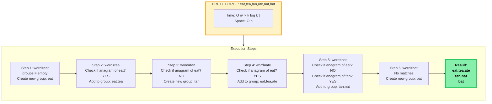
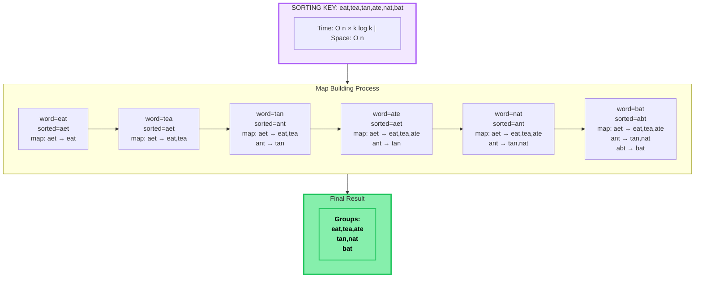
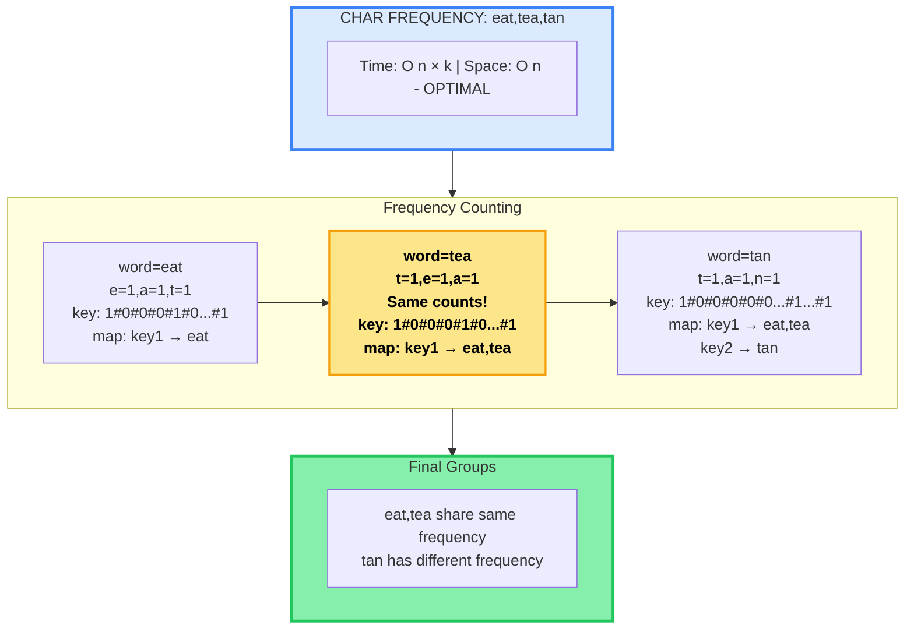
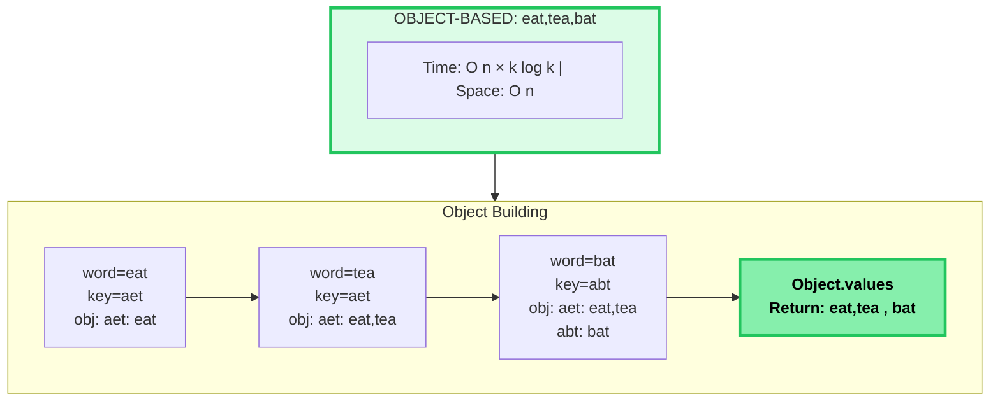
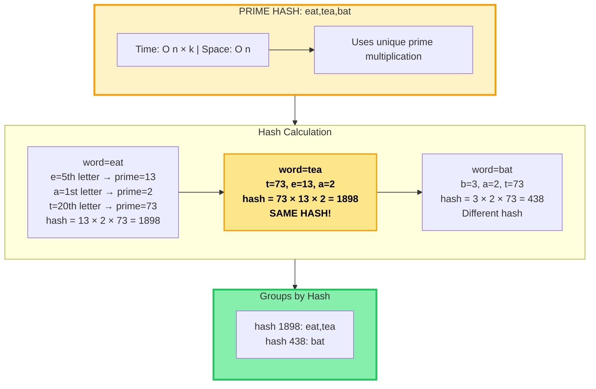
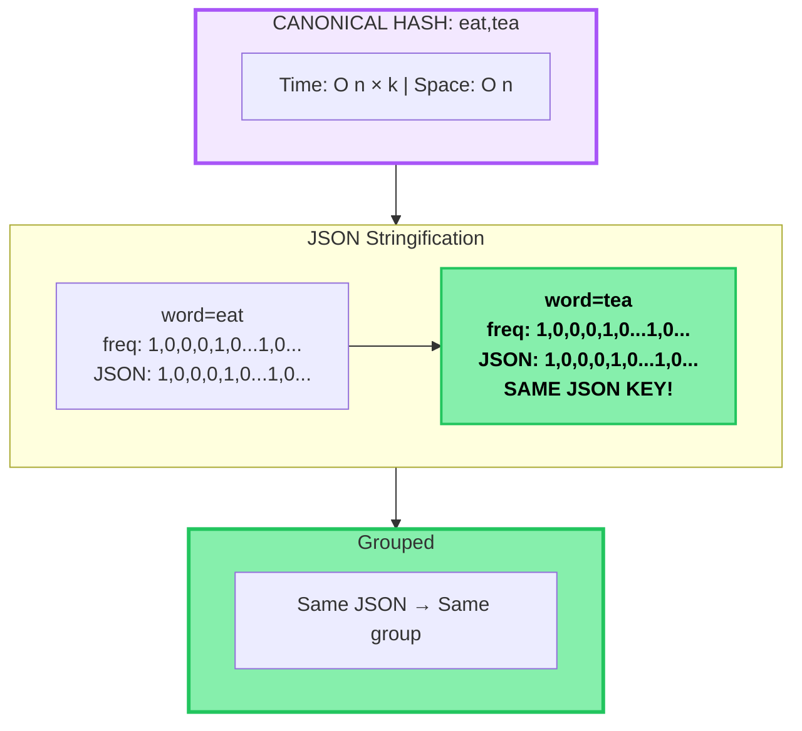
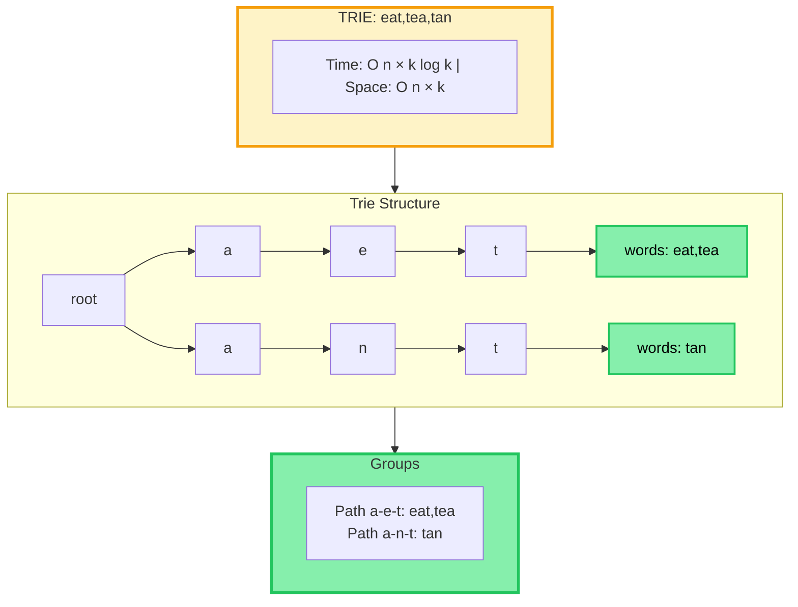
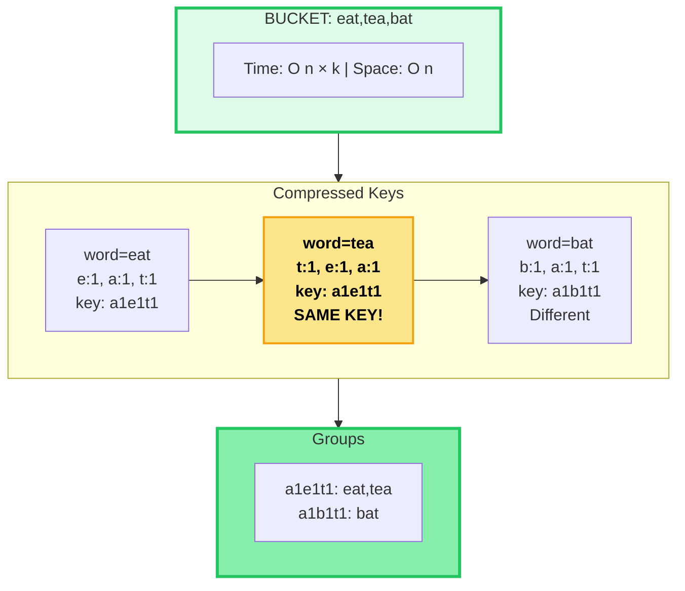

# 1. BRUTE FORCE

```mermaid
graph TB
    subgraph Header["BRUTE FORCE: eat,tea,tan,ate,nat,bat"]
        Title["Time: O n² × k log k | Space: O n"]
    end
    
    subgraph Steps["Execution Steps"]
        S1["Step 1: word=eat<br/>groups = empty<br/>Create new group: eat"]
        S2["Step 2: word=tea<br/>Check if anagram of eat? YES<br/>Add to group: eat,tea"]
        S3["Step 3: word=tan<br/>Check if anagram of eat? NO<br/>Create new group: tan"]
        S4["Step 4: word=ate<br/>Check if anagram of eat? YES<br/>Add to group: eat,tea,ate"]
        S5["Step 5: word=nat<br/>Check if anagram of eat? NO<br/>Check if anagram of tan? YES<br/>Add to group: tan,nat"]
        S6["Step 6: word=bat<br/>No matches<br/>Create new group: bat"]
        S7["Result:<br/>eat,tea,ate<br/>tan,nat<br/>bat"]
        
        S1 --> S2 --> S3 --> S4 --> S5 --> S6 --> S7
    end
    
    Header --> Steps
    
    style Header fill:#fef3c7,stroke:#f59e0b,stroke-width:3px
    style S7 fill:#86efac,stroke:#22c55e,stroke-width:3px,color:#000,font-weight:bold
```

# 2.SORTING KEY

```mermaid
graph TB
    subgraph Header["SORTING KEY: eat,tea,tan,ate,nat,bat"]
        Title["Time: O n × k log k | Space: O n"]
    end
    
    subgraph Process["Map Building Process"]
        P1["word=eat<br/>sorted=aet<br/>map: aet → eat"]
        P2["word=tea<br/>sorted=aet<br/>map: aet → eat,tea"]
        P3["word=tan<br/>sorted=ant<br/>map: aet → eat,tea<br/>ant → tan"]
        P4["word=ate<br/>sorted=aet<br/>map: aet → eat,tea,ate<br/>ant → tan"]
        P5["word=nat<br/>sorted=ant<br/>map: aet → eat,tea,ate<br/>ant → tan,nat"]
        P6["word=bat<br/>sorted=abt<br/>map: aet → eat,tea,ate<br/>ant → tan,nat<br/>abt → bat"]
        
        P1 --> P2 --> P3 --> P4 --> P5 --> P6
    end
    
    subgraph Result["Final Result"]
        R1["Groups:<br/>eat,tea,ate<br/>tan,nat<br/>bat"]
    end
    
    Header --> Process
    Process --> Result
    
    style Header fill:#f3e8ff,stroke:#a855f7,stroke-width:3px
    style Result fill:#86efac,stroke:#22c55e,stroke-width:3px
    style R1 fill:#86efac,stroke:#22c55e,stroke-width:2px,color:#000,font-weight:bold
```

# 3. CHARACTER FREQUENCY

```mermaid
graph TB
    subgraph Header["CHAR FREQUENCY: eat,tea,tan"]
        Title["Time: O n × k | Space: O n - OPTIMAL"]
    end
    
    subgraph Process["Frequency Counting"]
        P1["word=eat<br/>e=1,a=1,t=1<br/>key: 1#0#0#0#1#0...#1<br/>map: key1 → eat"]
        P2["word=tea<br/>t=1,e=1,a=1<br/>Same counts!<br/>key: 1#0#0#0#1#0...#1<br/>map: key1 → eat,tea"]
        P3["word=tan<br/>t=1,a=1,n=1<br/>key: 1#0#0#0#0#0...#1...#1<br/>map: key1 → eat,tea<br/>key2 → tan"]
        
        P1 --> P2 --> P3
    end
    
    subgraph Result["Final Groups"]
        R1["eat,tea share same frequency<br/>tan has different frequency"]
    end
    
    Header --> Process
    Process --> Result
    
    style Header fill:#dbeafe,stroke:#3b82f6,stroke-width:3px
    style Result fill:#86efac,stroke:#22c55e,stroke-width:3px
    style P2 fill:#fde68a,stroke:#f59e0b,stroke-width:2px,color:#000,font-weight:bold
```

# 4. OBJECT-BASED

```mermaid
graph TB
    subgraph Header["OBJECT-BASED: eat,tea,bat"]
        Title["Time: O n × k log k | Space: O n"]
    end
    
    subgraph Steps["Object Building"]
        S1["word=eat<br/>key=aet<br/>obj: aet: eat"]
        S2["word=tea<br/>key=aet<br/>obj: aet: eat,tea"]
        S3["word=bat<br/>key=abt<br/>obj: aet: eat,tea<br/>abt: bat"]
        S4["Object.values<br/>Return: eat,tea , bat"]
        
        S1 --> S2 --> S3 --> S4
    end
    
    Header --> Steps
    
    style Header fill:#dcfce7,stroke:#22c55e,stroke-width:3px
    style S4 fill:#86efac,stroke:#22c55e,stroke-width:3px,color:#000,font-weight:bold
```

# 5. PRIME MULTIPLICATION

```mermaid
graph TB
    subgraph Header["PRIME HASH: eat,tea,bat"]
        Title["Time: O n × k | Space: O n"]
        Note["Uses unique prime multiplication"]
        Title --> Note
    end
    
    subgraph Calculation["Hash Calculation"]
        C1["word=eat<br/>e=5th letter → prime=13<br/>a=1st letter → prime=2<br/>t=20th letter → prime=73<br/>hash = 13 × 2 × 73 = 1898"]
        C2["word=tea<br/>t=73, e=13, a=2<br/>hash = 73 × 13 × 2 = 1898<br/>SAME HASH!"]
        C3["word=bat<br/>b=3, a=2, t=73<br/>hash = 3 × 2 × 73 = 438<br/>Different hash"]
        
        C1 --> C2 --> C3
    end
    
    subgraph Result["Groups by Hash"]
        R1["hash 1898: eat,tea<br/>hash 438: bat"]
    end
    
    Header --> Calculation
    Calculation --> Result
    
    style Header fill:#fef3c7,stroke:#f59e0b,stroke-width:3px
    style C2 fill:#fde68a,stroke:#f59e0b,stroke-width:2px,color:#000,font-weight:bold
    style Result fill:#86efac,stroke:#22c55e,stroke-width:3px
```

# 6. CANONICAL HASH

```mermaid
graph TB
    subgraph Header["CANONICAL HASH: eat,tea"]
        Title["Time: O n × k | Space: O n"]
    end
    
    subgraph Process["JSON Stringification"]
        P1["word=eat<br/>freq: 1,0,0,0,1,0...1,0...<br/>JSON: 1,0,0,0,1,0...1,0..."]
        P2["word=tea<br/>freq: 1,0,0,0,1,0...1,0...<br/>JSON: 1,0,0,0,1,0...1,0...<br/>SAME JSON KEY!"]
        
        P1 --> P2
    end
    
    subgraph Result["Grouped"]
        R1["Same JSON → Same group"]
    end
    
    Header --> Process
    Process --> Result
    
    style Header fill:#f3e8ff,stroke:#a855f7,stroke-width:3px
    style P2 fill:#86efac,stroke:#22c55e,stroke-width:2px,color:#000,font-weight:bold
    style Result fill:#86efac,stroke:#22c55e,stroke-width:3px
```

# 7.TRIE-BASED

```mermaid
graph TB
    subgraph Header["TRIE: eat,tea,tan"]
        Title["Time: O n × k log k | Space: O n × k"]
    end
    
    subgraph TrieStructure["Trie Structure"]
        Root["root"]
        A1["a"]
        E1["e"]
        T1["t"]
        Words1["words: eat,tea"]
        
        A2["a"]
        N1["n"]
        T2["t"]
        Words2["words: tan"]
        
        Root --> A1
        A1 --> E1
        E1 --> T1
        T1 --> Words1
        
        Root --> A2
        A2 --> N1
        N1 --> T2
        T2 --> Words2
    end
    
    subgraph Result["Groups"]
        R1["Path a-e-t: eat,tea<br/>Path a-n-t: tan"]
    end
    
    Header --> TrieStructure
    TrieStructure --> Result
    
    style Header fill:#fef3c7,stroke:#f59e0b,stroke-width:3px
    style Words1 fill:#86efac,stroke:#22c55e,stroke-width:2px,color:#000
    style Words2 fill:#86efac,stroke:#22c55e,stroke-width:2px,color:#000
    style Result fill:#86efac,stroke:#22c55e,stroke-width:3px
```

# 8. BUCKET COUNTING

```mermaid
graph TB
    subgraph Header["BUCKET: eat,tea,bat"]
        Title["Time: O n × k | Space: O n"]
    end
    
    subgraph Keys["Compressed Keys"]
        K1["word=eat<br/>e:1, a:1, t:1<br/>key: a1e1t1"]
        K2["word=tea<br/>t:1, e:1, a:1<br/>key: a1e1t1<br/>SAME KEY!"]
        K3["word=bat<br/>b:1, a:1, t:1<br/>key: a1b1t1<br/>Different"]
        
        K1 --> K2 --> K3
    end
    
    subgraph Result["Groups"]
        R1["a1e1t1: eat,tea<br/>a1b1t1: bat"]
    end
    
    Header --> Keys
    Keys --> Result
    
    style Header fill:#dcfce7,stroke:#22c55e,stroke-width:3px
    style K2 fill:#fde68a,stroke:#f59e0b,stroke-width:2px,color:#000,font-weight:bold
    style Result fill:#86efac,stroke:#22c55e,stroke-width:3px
```